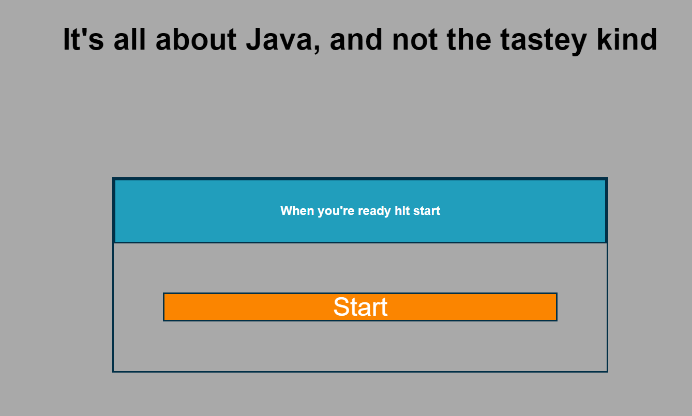

# Challenge 04
## Description
For this assignment I have created an interactive quiz about javascript. The quiz starts when you press the start button and cylces through the questions which then leads to a simple username input which records username and score to local memory. 

I am not entirely happy with the layout and the styling as I was figuring out how the logic worked for 99% of the time. If I had more time or were to do this over. I would create all the main structure beforehand in the index file and assign ID's to start with, and use the sript to simply change attributes. This way I would be able to define global variables to call from instead of creating and appending DOM objects inside of functions. Also, I would start with bootstrap for styling as I have just recently learned about it.

The way I have the site set up at the moment is the start page is hard coded into the html/css file and an event listener listens for the startBtn Click. Inside the startBtn click a function re assigns the attributes of the li items and calls the queryQuestion function. I'm happy quite happy with the queryQuestion function. The functions pulls from an array of objects 'questionPool' randomizes a position to place the correct question in and then pulls three random answers from other questions to place randomly into the other three spots.

If time runs out or the quiz is finished the script calls the endQuiz function which then displays the results of the quiz and also generates the form to take in user name input which then stores and displays locally saved data.

## link to live site.
https://magiccrouton.github.io/EugeneParkHW4-GTbootcamp/

## link to HW4 Repo
https://github.com/MagicCrouton/EugeneParkHW4-GTbootcamp.git

##link to overall githup
https://github.com/MagicCrouton

## Credits
questions and answers were found on quizlet; 
https://quizlet.com/234928595/question-pool-quiz-3-chapter-3-flash-cards/
color scheme was found with Coolrs.com
https://coolors.co/palettes/trending

## License
N/A